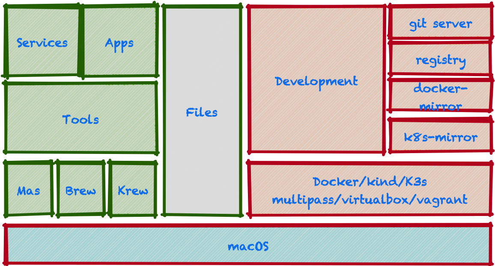

# Brew for macOS software management



We use Homebrew a.k.a. brew to install software on our
Cloud Native Base Camp macOS computers.

## Introduction

This repository has our Brew, which manages much of the software that we use for projects.

This Brew helps us install:

- Hundreds of desktop applications, such as browsers, players, editors, etc.
- Hundreds of system utilities, such as command line interfaces, sysop helpers, etc.
- Dozens of programming capabilties, such as languages, toolchains, servers, etc.

To learn about brew and Brewfile capabilties, please see:

- https://brew.sh/
- https://homebrew-file.readthedocs.io/
- https://github.com/Homebrew/homebrew-bundle
- https://github.com/mas-cli/mas

Using a Brew helps us with our Infrastructure as Code (IaC) initiatives.

Feedback welcome. Pull requests welcome.

## Inspired from this repos

- https://github.com/StefanScherer/dotfiles
- https://github.com/paulirish/dotfiles

## brewup your mac with happiness

With the bee42 honeypod brewup installer

- https://github.com/nvm-sh/nvm
- https://github.com/moovweb/gvm
- https://github.com/rupa/z.git
- https://github.com/gmarik/vundle.git
- https://krew.sigs.k8s.io
- https://dagger.io
  - https://dagger.io/blog/introducing-dagger-functions

tmux
- https://hamvocke.com/blog/a-quick-and-easy-guide-to-tmux/
- https://hamvocke.com/blog/a-guide-to-customizing-your-tmux-conf/
- https://dev.to/techspresso/tmux-and-vscode-persist-terminals-for-productivity-and-profit-2nd1
- https://pragprog.com/titles/bhtmux2/tmux-2/
- https://github.com/tmux/tmux/wiki
- https://github.com/jonmosco/kube-tmux
- https://arcolinux.com/everything-you-need-to-know-about-tmux-status-bar/
- https://gist.github.com/endersonmaia/3902b94585ef46a9956c0ca9e901cbdf
- https://gist.github.com/dmytro/3984680

  - multiple ssh sessions

```bash
mkdir -p $HOME/.tmux/
cd $HOME/.tmux/
git clone --depth 1 https://github.com/jonmosco/kube-tmux
#curl -sL -o $HOME/.tmux/kube-tmux/kube.tmux \
#  https://raw.githubusercontent.com/jonmosco/kube-tmux/master/kube.tmux
#chmod +x $HOME/.tmux/kube-tmux/kube.tmux
cat >>~/.tmux.conf <<EOF
set -g status-right "#(/bin/bash $HOME/.tmux/kube-tmux/kube.tmux 250 red cyan)"
EOF
tmux source ~/.tmux.conf
```

## SSH key

* https://docs.github.com/de/authentication/connecting-to-github-with-ssh/generating-a-new-ssh-key-and-adding-it-to-the-ssh-agent

```shell
ssh-keygen -t ed25519 -C "peter.rossbach@bee42.com" -f ~/.ssh/id_ed25519-github
cat >>~/.ssh/config <<EOF
Host github.com
  User git
  AddKeysToAgent yes
  UseKeychain yes
  IdentityFile ~/.ssh/id_ed25519-github
EOF
ssh-add --apple-use-keychain ~/.ssh/id_ed25519-github
# Add new key to your github account
cat ~/.ssh/id_ed25519-github.pub | pbcopy
```

Mac Apps

- https://rectangleapp.com
- https://daisydiskapp.com
- https://bjango.com/mac/istatmenus/
- https://github.com/chipmk/docker-mac-net-connect
  - forward all ports from your docker for mac vm :)
- Wireguard
- XCode
  
On a fresh mac - make backup with timemachine first!

```shell
xcode-select --install
# find dialog and install the developer tools
mkdir -p ~/develop && cd ~develop
git clone --depth 1 https://github.com/rossbachp/brewup
cd brewup
# install brew 
./happiness -b
(echo; echo 'eval "$(/opt/homebrew/bin/brew shellenv)"') >> $HOME/.zprofile
eval "$(/opt/homebrew/bin/brew shellenv)"
# brew full
./happiness -f
./happiness -D
# add defaults
./sync.sh
# start docker services
./happiness -c
# add docker plugins
./happiness -d
```

Full installation

```bash
curl -fsSL -o happiness https://raw.githubusercontent.com/rossbachp/brewup/main/happiness | bash
````

Features:

- check_macos_updated
- install_brew
- install_brewup
- install_terminal_profiles
- install_brew_packages

- https://krew.sigs.k8s.io/docs/user-guide/setup/install/
- https://github.com/Fred78290/vagrant-multipass
- https://ohmyz.sh/#install

More options:

```shell
./happiness --help
```

## Other options

- docker registry and local git server
- install MAS apps
- Install krew plugins

### Planned

- docker tap support for better access LB and docker network

```shell
# Install via Homebrew
brew install chipmk/tap/docker-mac-net-connect
# Run the service and register it to launch at boot
sudo brew services start chipmk/tap/docker-mac-net-connect
```

- Create kubernetes Resource graphs with [kubectl-graph](https://github.com/steveteuber/kubectl-graph)

```shell

docker run -d -p 7474:7474 -p 7687:7687 -e NEO4J_AUTH=neo4j/secret neo4j
# argodb?
kubectl graph pods --field-selector status.phase=Running -n kube-system | dot -T svg -o pods.svg
```

- Start kubernetes cluster with k3d or kind
  - add fluxcd support :)
  - cloudflared tunnel

- support 1password vault
  - https://external-secrets.io/v0.5.7/provider-1password-automation/#deploy-a-connect-server
  - https://github.com/1Password/connect/tree/a0a5f3d92e68497098d9314721335a7bb68a3b2d/examples/kubernetes

## Mas

- https://github.com/mas-cli/mas

```shell
mas search Xcode
   497799835  Xcode (15.2)
mas search wireguard 
  1451685025  WireGuard                     (1.0.16)
mas search Whatsapp 
  310633997  WhatsApp Messenger                                       (24.4.4)
mas search BlackMagic
   425264550  Blackmagic Disk Speed Test     (3.4.2)
```

## Docker and Kubernetes Support

- Support Docker extensions cli

```shell
docker extension list --format="json" | jq -r ".[].image"
```

- Support containerd immage store

Start a shell at your Docker VM

- https://gist.github.com/BretFisher/5e1a0c7bcca4c735e716abf62afad389

Sorry is readonly file system....
exit
```shell
docker run -it --rm --privileged --pid=host justincormack/nsenter1
cat >>/etc/containerd/config.toml <<EOF

  [plugins."io.containerd.grpc.v1.cri".registry]
    [plugins."io.containerd.grpc.v1.cri".registry.mirrors]
      [plugins."io.containerd.grpc.v1.cri".registry.mirrors."docker.io"]
        endpoint = ["http://host.docker.internal:5001"]
      [plugins."io.containerd.grpc.v1.cri".registry.mirrors."registry.k8s.io"]
        endpoint = ["http://host.docker.internal:5002"]
EOF
```

## Ideas

- Use NIX
  - https://zero-to-nix.com 
  - https://sandstorm.de/de/blog/post/my-first-steps-with-nix-on-mac-osx-as-homebrew-replacement.html
- Use taskfile
  - Complitions:
  - https://github.com/Berger91/taskfile-zsh-autocompletion/blob/master/README.md

## Prototype Nix

```shell
curl --proto '=https' --tlsv1.2 -sSf -L https://install.determinate.systems/nix | sh -s -- install
nix --version
echo "Hello Nix" | nix run "nixpkgs#ponysay"
```

## Licensing

Copyright (c) 2024 Peter Rossbach <peter.rossbach@bee42.com>

MIT License, see [LICENSE.txt](LICENSE.txt) for more details.

Regards,

[`|-o-|` The pathfinder - Peter](mailto://peter.rossbach@bee42.com)
