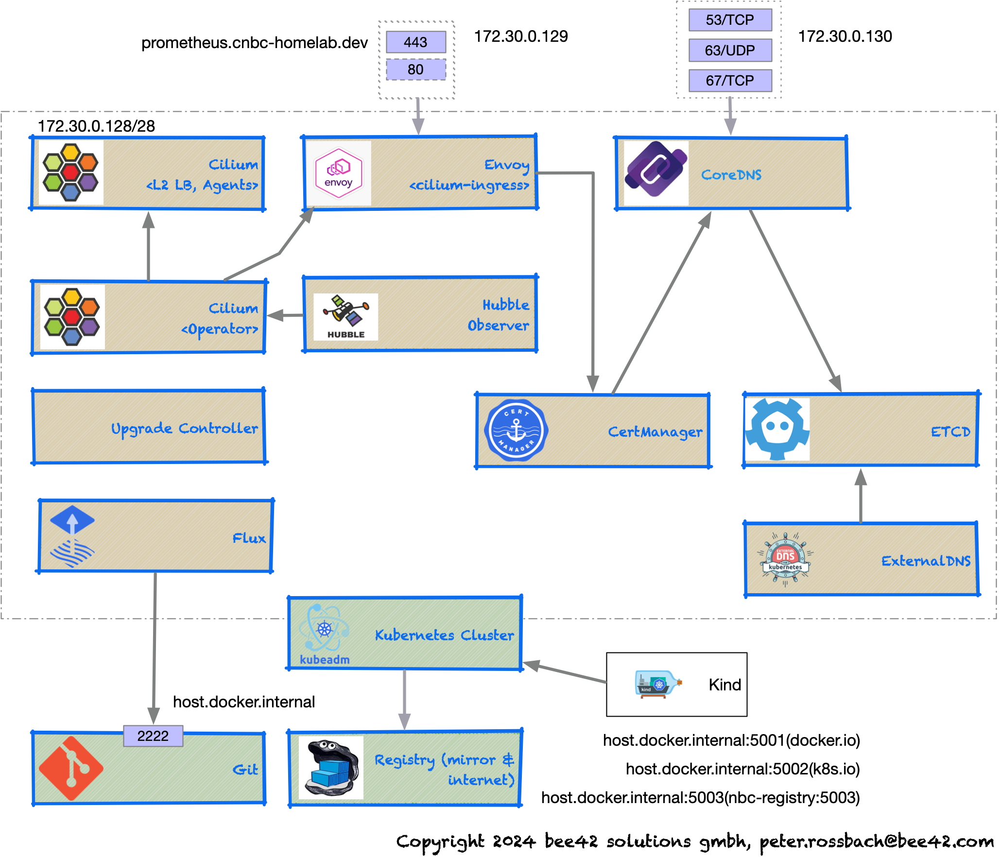

# Smart Kubernetes SRE platform: cnbc-homelab 

Features:

- start a small local kubernetes cluster
- use cilium as cni provider
- add fluxcd to the cluster
- start your local gitops continously improved kubernetes infrastrcuture development cycle
- add CertManager, ExternalDNS(CoreDNS,ETCD), UpgradeController
- Add Observability stack

Todo:

- fluxcd setup
- add github action pipeline to validate the setup
- improve the tools
- add more taskfile tasks

## Kind edition

## K3d edition

## Licensing

Copyright (c) 2024 Peter Rossbach <peter.rossbach@bee42.com>

MIT License, see [LICENSE.txt](../../LICENSE.txt) for more details.

Regards,

[`|-o-|` The pathfinder - Peter](mailto://peter.rossbach@bee42.com)
