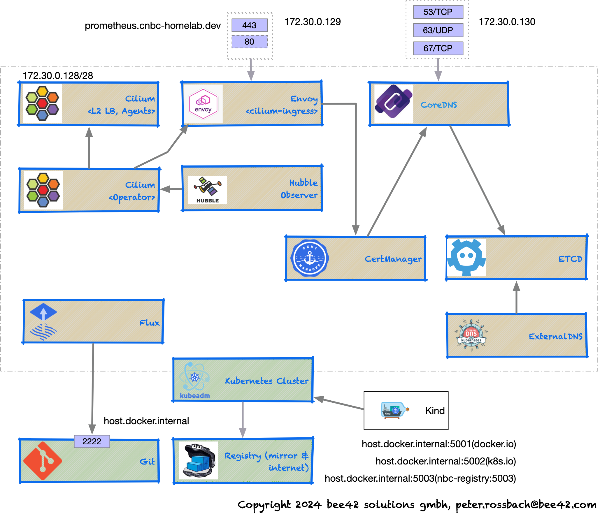

# Smart Kubernetes SRE platform: cnbc-homelab

Features:

- start a smart local CNBC based kubernetes cluster
  - use local mirrors
  - use local git server
  - use the brewup based tools :octopus:
  - access your L2 loadbalancer IPs with [docker-mac-net-connect[(https://github.com/chipmk/docker-mac-net-connect)]
- use [cilium](https://cilium.io) as cni provider
  - smart network communiation on steriods (eBPF)
  - envoy as ingress controller
  - total network observability with [hubble](https://github.com/cilium/hubble)
  - ServiceMesh with low overhead (No sidecar proxies anymore)
  - Use Cilium NetworkPolicies
- add [fluxcd](https://fluxcd.io) to the cluster
- start your local gitops continously improved kubernetes infrastrcuture development cycle and acivate your infrastrcuture extensions
- add the network cartridge
  - [CertManager](https://cert-manager.io)
  - [ExternalDNS](https://github.com/kubernetes-sigs/external-dns)
    - [CoreDNS](https://coredns.io)
    - [ETCD](https://etcd.io))
- add the observability cartridge
  - Prometheus
  - Grafana
  - Loki
  - Tempo

Todo:

- fluxcd setup
- add github action pipeline to validate the setup
- improve the tools
- add more taskfile tasks
- define more cartridges

## Kind edition

Find more information to install and use it at this [README](./kind/README.md).

## K3d edition

Find more information to install and use it at this [README](./k3d/README.md).

## Licensing

Copyright (c) 2024 Peter Rossbach <peter.rossbach@bee42.com>

MIT License, see [LICENSE.txt](../../LICENSE.txt) for more details.

Regards,

[`|-o-|` The pathfinder - Peter](mailto://peter.rossbach@bee42.com)
